# OWLBY

Endpoint의 보안 이벤트를 수집하고 위협을 탐지하는 EDR 플랫폼, OWLBY


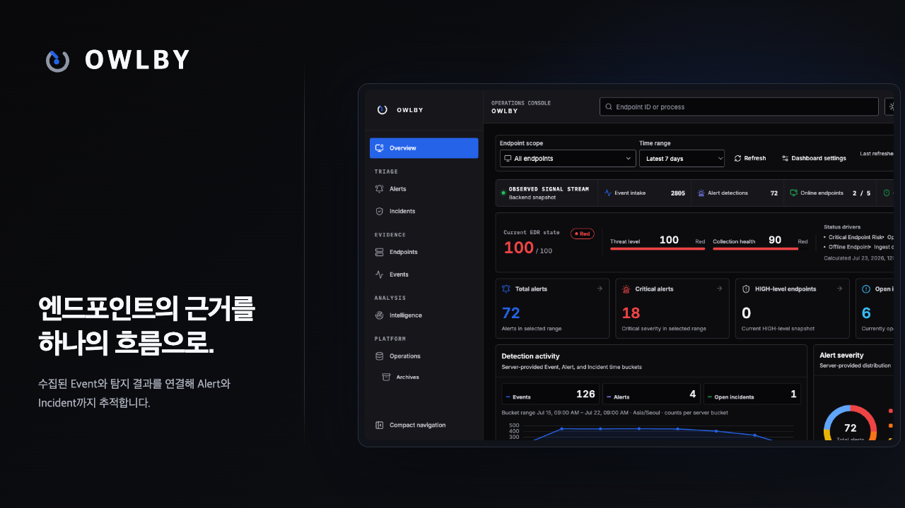

### 종합 현황 및 Endpoint 모니터링

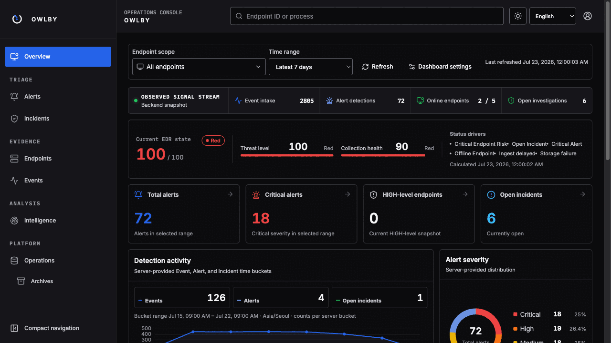

5개 Endpoint의 수집 상태와 위험도를 확인하고, 위험 Endpoint의 Alert와 Incident로 바로 이동합니다.

### Event 검색 및 분석

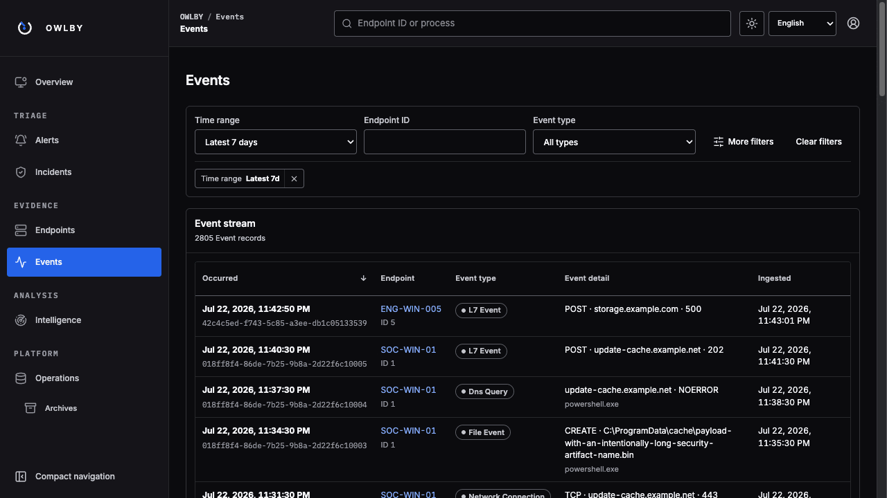

최근 7일의 범위에서 Event를 유형별로 검색하고, 원본 필드와 Process Tree, Raw Payload를 확인합니다.

### Alert 분류

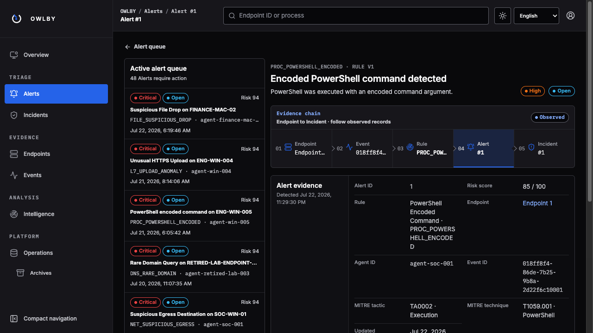

Severity, Risk, Status를 기준으로 Alert을 분류하고 `Endpoint → Event → Rule → Alert → Incident` 근거의 흐름을 추적합니다.

### Incident 조사

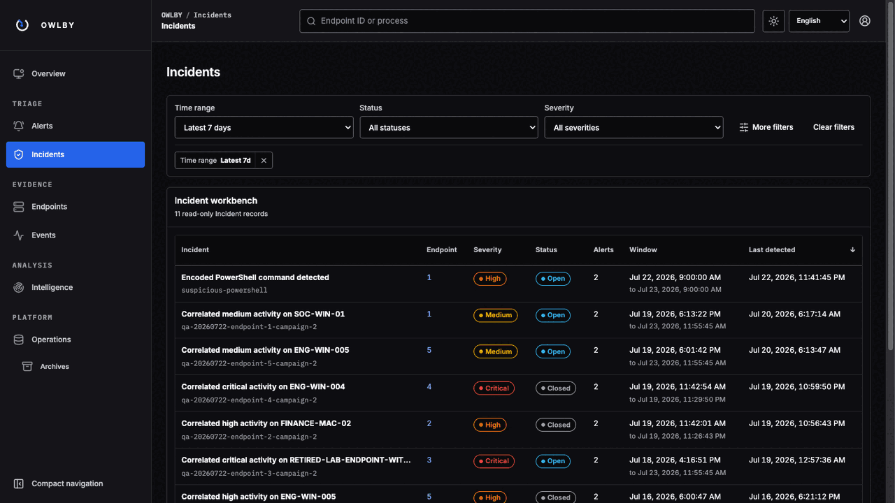

연결된 Alert과 Event를 Investigation 그래프로 확장하고 Attack Timeline에서 조사할 근거를 선택합니다.

### IP 및 Domain 분석

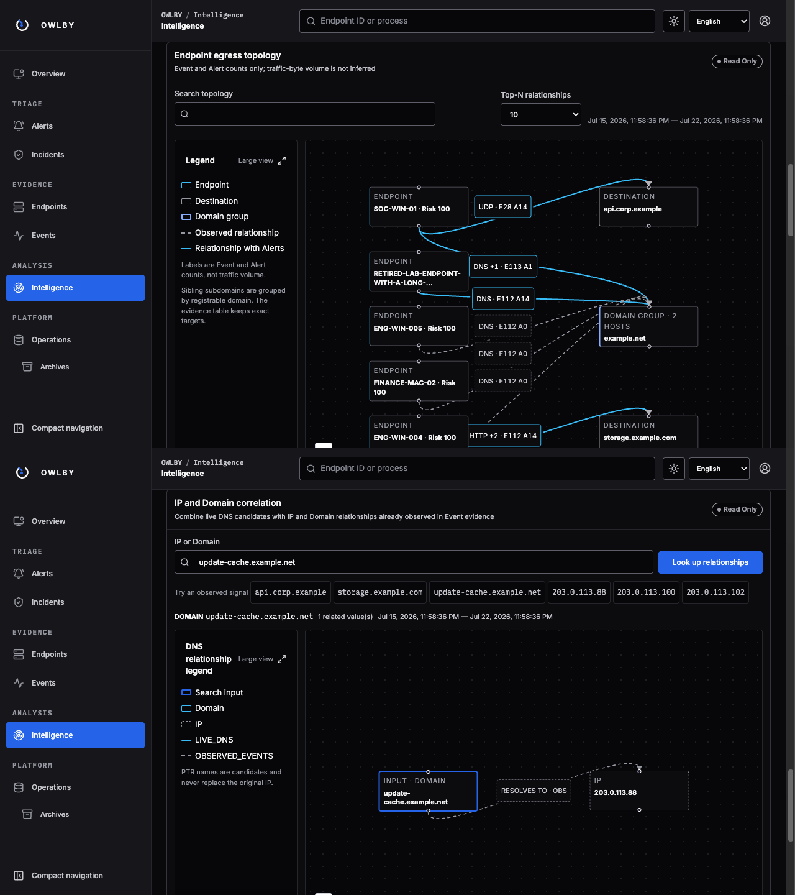

Endpoint의 외부 통신 관계를 비교하고 관측된 IP 또는 Domain을 기준으로 관련 근거를 조회합니다.

### 운영 및 Archive 관리

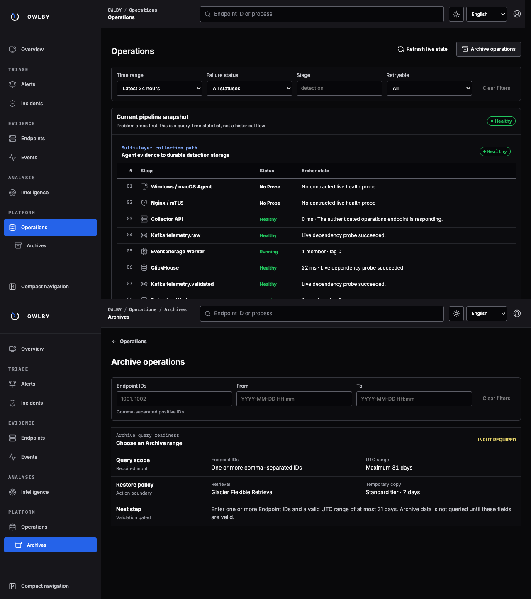

Collector, Kafka, Worker, 저장소 상태를 점검하고 Endpoint와 기간을 지정해 Archive 복원 범위를 관리합니다.

## 주요 기능

## 시스템 아키텍처


### Event 수집 구조


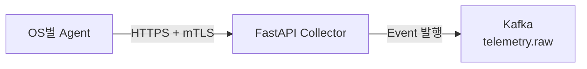


각 엔드포인트별 OS에 맞는 에이전트가 프로세스, 네트워크, 파일, DNS, L7 메타데이터를 수집합니다.
에이전트는 고유 인증서를 사용해 HTTP, mTLS로 인증하고, 수집한 이벤트를 FASTAPI collector로 전송합니다.
collector는 에이전트의 인증 정보와 이벤트 형식을 검증한 뒤 kafka의 telemetry.raw에 토픽을 발행합니다.

### 탐지 처리 구조

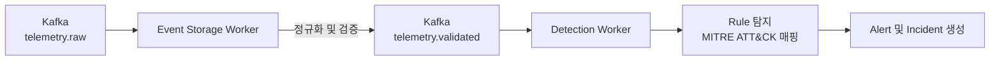

이벤트 스토리지 워커가 telemetry.raw 토픽의 이벤트를 소비해 형식을 정규화 및 검증합니다.
검증을 통과한 이벤트는 telemetry.validated 토픽으로 전달됩니다.
탐지 워커는 이벤트에 탐지 규칙을 적용합니다.
이 과정에서 위험도를 계산하며 MITRE ATT&CK 전술/기술을 연관지어 탐지 결과를 발행하고 이를 Alert과 Incident로 생성합니다.

### 데이터 저장 구조

대량의 이벤트는 빠른 검색, 집계를 위해 ClickHouse에 저장됩니다.
서비스 운영에 필요한 엔드포인트, 사용자, 인시던트 등의 관계형 데이터는 PostgreSQL에 저장됩니다.
장기 보관용 데이터와 재처리가 필요한 실패 페이로드는 S3에 저장됩니다.

| 저장소        | 저장 데이터                      | 용도               |
| ---------- | --------------------------- | ---------------- |
| ClickHouse | 프로세스·네트워크·파일·DNS·L7 Event   | 대량 Event 검색 및 집계 |
| PostgreSQL | Endpoint·사용자·Alert·Incident | 상태 및 데이터 관계 관리   |
| Amazon S3  | 장기 보관 데이터·실패 Payload        | Archive 및 실패 재처리 |

## API


## ERD


## 모니터링 및 로그

Grafana Alloy가 호스트, Docker, Kafka, 백엔드의 메트릭과 Docker 컨테이너 로그를 수집합니다. 메트릭은 Grafana Cloud Metrics로, 로그는 Grafana Cloud Logs로 전송해 운영 상태를 한곳에서 확인합니다.

### 메트릭 수집 상태

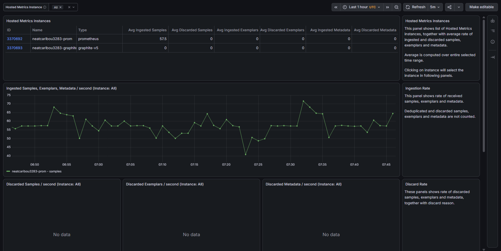

Hosted Metrics 인스턴스별 수집률과 discarded samples, exemplars, metadata를 확인해 메트릭 파이프라인이 정상적으로 동작하는지 점검합니다.

### 메트릭 및 Label Cardinality

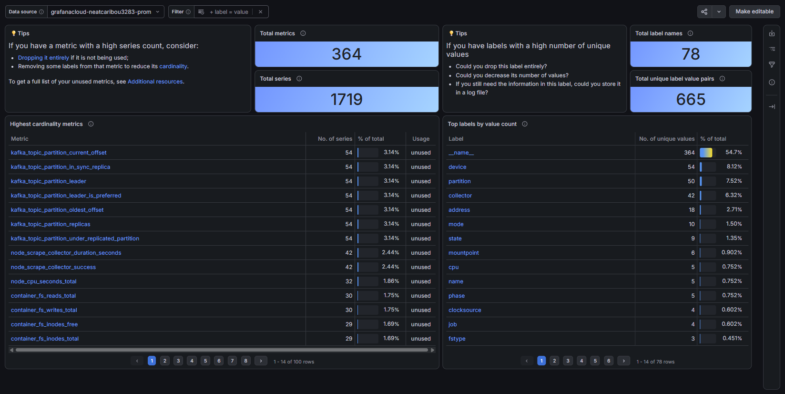

전체 Metric과 Series 규모, Label별 고유 값 수를 확인해 불필요하거나 cardinality가 높은 메트릭을 식별합니다.

## 기술 스택

| 구분 | 기술 |
| --- | --- |
| Agent |    |
| Frontend |      |
| Backend |     |
| Event Pipeline |  |
| Detection |  |
| Database |   |
| Object Storage |  |
| Infrastructure |   |
| Deployment |     |
| Monitoring |   |


## 빠른 실행

Docker Desktop이 필요합니다.

```powershell
git clone https://github.com/Techeer-Bootcamp-2026-Summer-Team-C/team-C.git
Set-Location .\team-C
docker compose up -d --build --wait
```

Dashboard: http://127.0.0.1:8080

관리자 계정은 최초 실행 시 `runtime/demo/credentials.json`에 자동 생성되며 해당 파일은 Git에 포함되지 않습니다.

## 팀원 소개

|                               황 건 하                               |                              박 소 연                               |                               이 혜 령                                |                             이 주 호                             |
| :---------------------------------------------------------------: | :--------------------------------------------------------------: | :----------------------------------------------------------------: | :-----------------------------------------------------------: |
|  |  |  |  |
|              [@altius03](https://github.com/altius03)              |             [@yoskrap](https://github.com/yoskrap)             |           [@hyernglee](https://github.com/hyernglee)           |            [@coder072](https://github.com/coder072)            |
|                     Team Leader<br>Full Stack                     |                       Full Stack<br>DevOps                       |                         Frontend<br>Design                         |                            Backend                            |
