<div align="center">

# OWLBY

### Endpoint의 Signal을 조사 가능한 Evidence로 연결하는 EDR 플랫폼

Windows와 macOS Endpoint에서 보안 Event를 수집하고,<br>
Endpoint → Event → Rule → Alert → Incident 흐름으로 위협 근거를 추적합니다.

[**서비스**](http://tukproject.dev) ·
[**Medium**](https://medium.com/@daydreaming0721/techeer-bootcamp-edr-43bf1b99176f) ·
[**발표 자료**](https://canva.link/team-c)

</div>

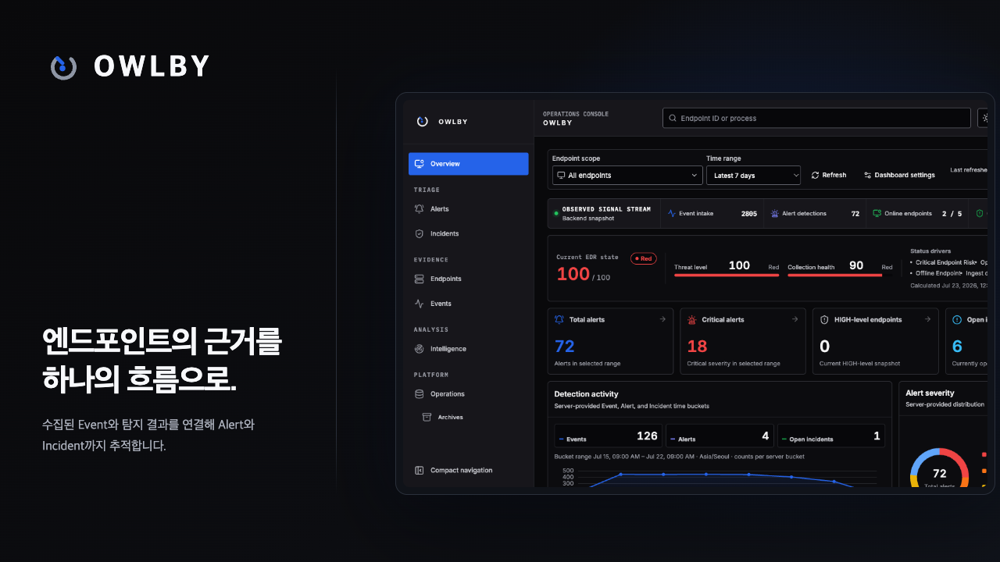

## 목차

- [프로젝트 소개](#프로젝트-소개)
- [주요 기능](#주요-기능)
- [시스템 아키텍처](#시스템-아키텍처)
- [API](#api)
- [ERD](#erd)
- [기술 스택](#기술-스택)
- [모니터링 및 로그](#모니터링-및-로그)
- [CI/CD 및 GitOps](#cicd-및-gitops)
- [빠른 실행](#빠른-실행)
- [팀원 소개](#팀원-소개)

## 프로젝트 소개

OWLBY는 Windows와 macOS Endpoint에서 발생하는 보안 Event를 수집하고 위협을 탐지하는 EDR 플랫폼입니다.

수집한 Event를 Rule과 MITRE ATT&CK 정보에 따라 Alert과 Incident로 연결하고, Dashboard에서 Endpoint 상태와 탐지 근거를 확인할 수 있습니다.

## 주요 기능

### 종합 현황 및 Endpoint 모니터링

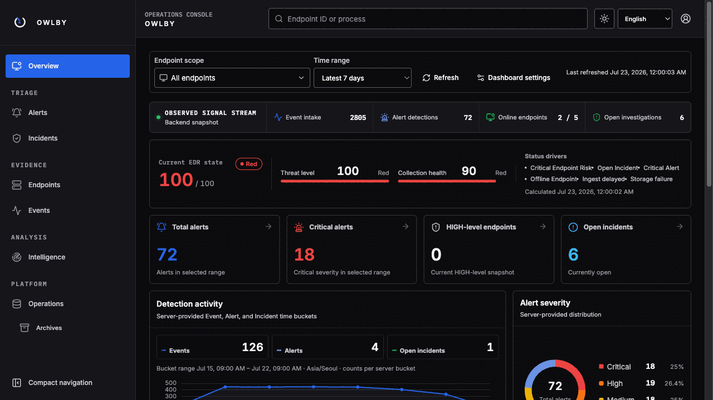

Endpoint별 수집 상태와 위험도를 한눈에 확인하고, 위험 Endpoint에서 연관 Alert과 Incident로 바로 이동합니다.

### Event 검색 및 분석

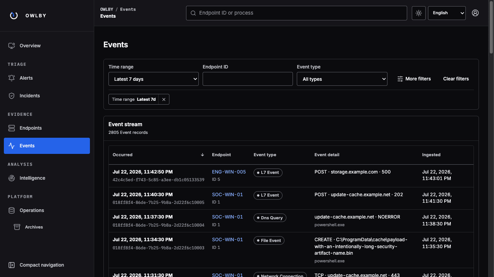

기간과 Event 유형을 기준으로 검색하고, 원본 필드와 Process Tree, Raw Payload를 함께 분석합니다.

### Alert 분류

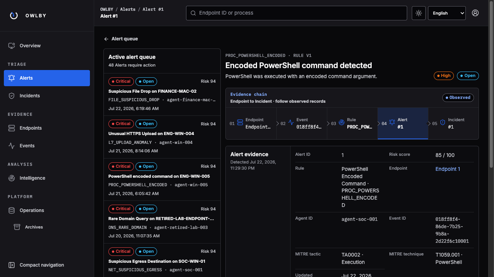

Severity, Risk, Status를 기준으로 Alert을 분류하고 Endpoint → Event → Rule → Alert → Incident Evidence Chain을 추적합니다.

### Incident 조사

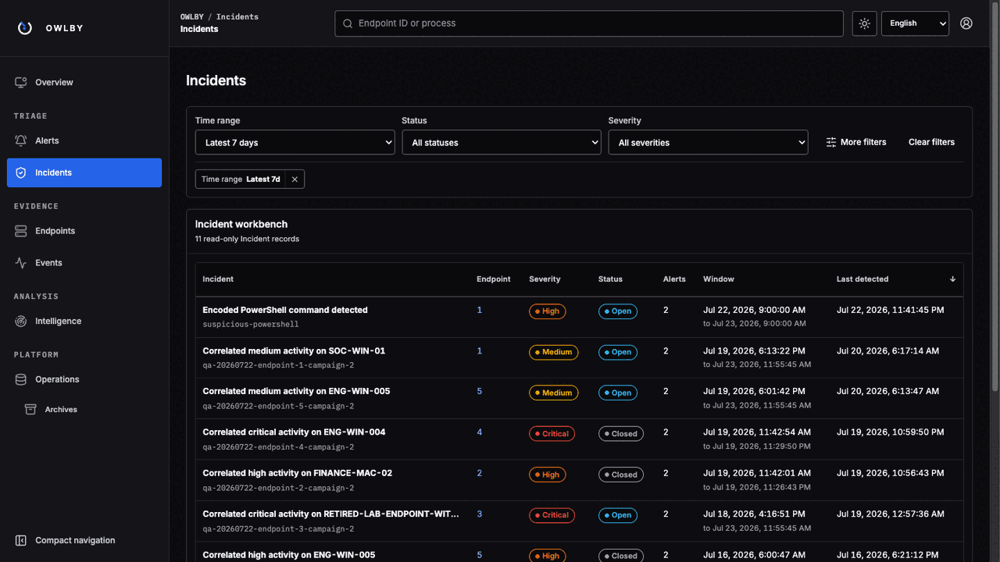

연결된 Alert과 Event를 Investigation Graph로 확장하고, Attack Timeline에서 조사할 Evidence를 선택합니다.

### IP 및 Domain 분석

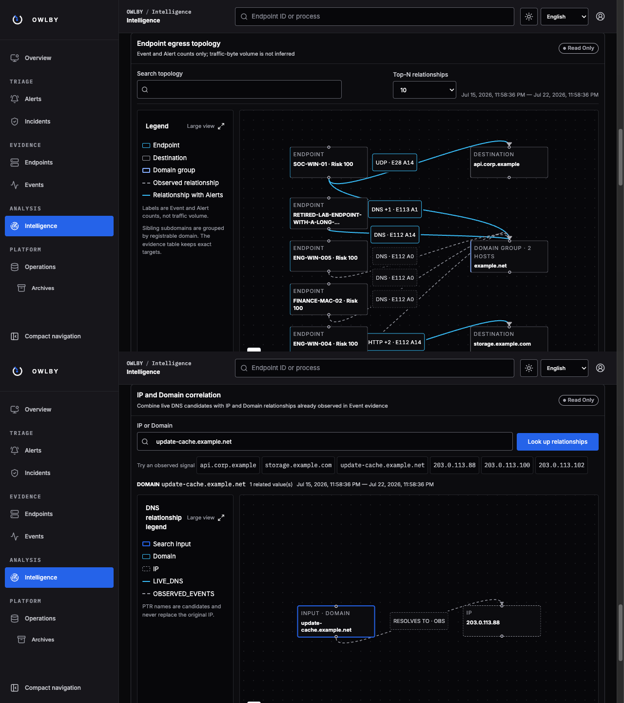

Endpoint의 외부 통신 관계를 비교하고, 관측된 IP 또는 Domain을 기준으로 관련 Evidence를 조회합니다.

### 운영 및 Archive 관리

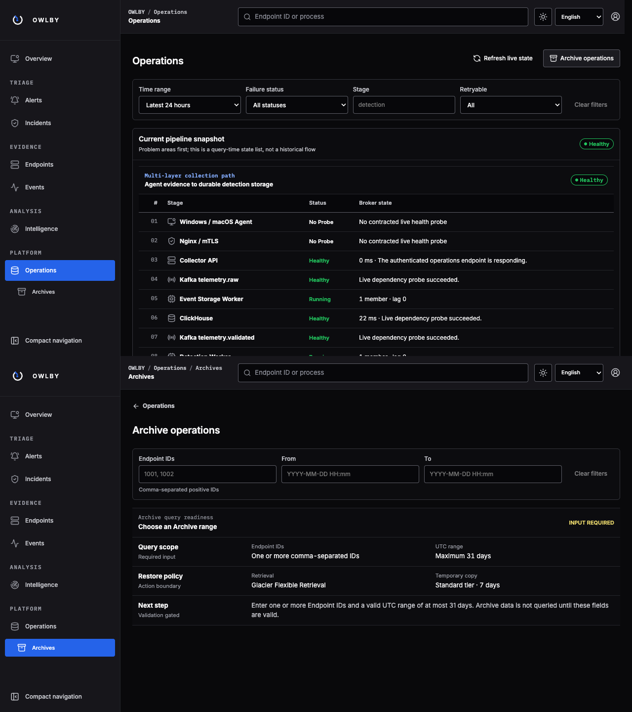

Collector, Kafka, Worker, 저장소 상태를 점검하고 Endpoint와 기간을 지정해 Archive 복원 범위를 관리합니다.

## 시스템 아키텍처

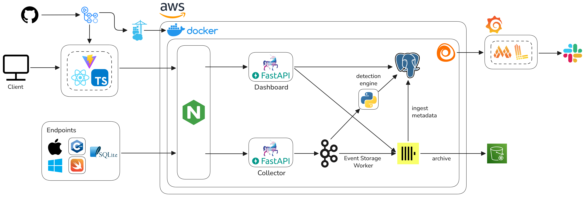


### Event 수집 구조

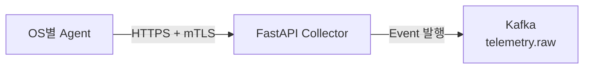
```mermaid
flowchart LR
    A["OS별 Agent"]
    B["FastAPI Collector"]
    C["Kafka<br/>telemetry.raw"]

    A -->|"HTTPS + mTLS"| B
    B -->|"Event 발행"| C
```

OS별 Agent가 Process, Network, File, DNS, L7 metadata를 수집합니다. Agent는 고유 인증서로 인증한 뒤 Event를 FastAPI Collector에 전송하고, Collector는 인증 정보와 형식을 검증해 Kafka `telemetry.raw` Topic으로 발행합니다.

### 탐지 처리 구조

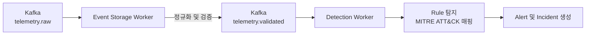
```mermaid
flowchart LR
    A["Kafka<br/>telemetry.raw"]
    B["Event Storage Worker"]
    C["Kafka<br/>telemetry.validated"]
    D["Detection Worker"]
    E["Rule 탐지<br/>MITRE ATT&CK 매핑"]
    F["Alert 및 Incident 생성"]

    A --> B
    B -->|"정규화 및 검증"| C
    C --> D
    D --> E
    E --> F
```

Event Storage Worker가 Event를 정규화·검증하고, Detection Worker가 Rule과 MITRE ATT&CK 정보를 적용해 Alert과 Incident를 생성합니다.

### 데이터 저장 구조

| 저장소 | 저장 데이터 | 용도 |
| --- | --- | --- |
| ClickHouse | Process·Network·File·DNS·L7 Event | 대량 Event 검색 및 집계 |
| PostgreSQL | Endpoint·사용자·Alert·Incident | 상태와 데이터 관계 관리 |
| Amazon S3 | 장기 보관 데이터·실패 Payload | Archive 및 실패 Event 재처리 |

## API


## ERD


## 기술 스택

| 구분 | 기술 |
| --- | --- |
| Agent |    |
| Frontend |      |
| Backend |     |
| Event Pipeline |  |
| Detection |  |
| Database |   |
| Object Storage |  |
| Infrastructure |   |
| Deployment |     |
| Monitoring |   |

## 모니터링 및 로그

Grafana Alloy가 Host, Docker, Kafka, Backend의 Metric과 Docker Container Log를 수집합니다. Metric은 Grafana Cloud Metrics로, Log는 Grafana Cloud Logs로 전송합니다.

### 메트릭 수집 상태

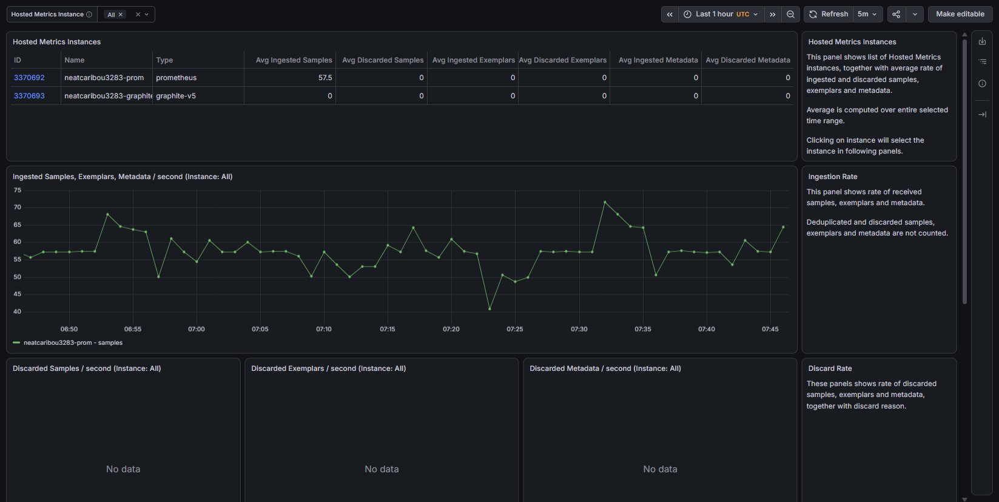

Hosted Metrics 인스턴스별 수집률과 discarded samples, exemplars, metadata를 확인해 Metric Pipeline 상태를 점검합니다.

### Metric 및 Label Cardinality

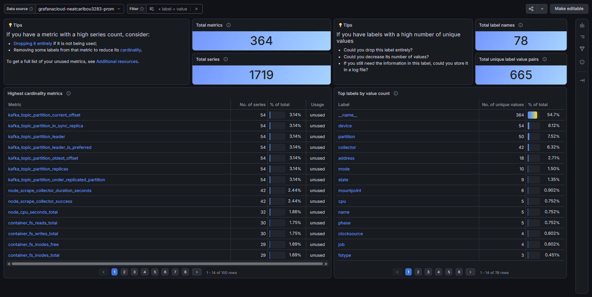

전체 Metric과 Series 규모, Label별 고유 값 수를 확인해 불필요하거나 Cardinality가 높은 Metric을 식별합니다.

## CI/CD 및 GitOps

Pull Request가 생성되면 GitHub Actions가 코드 품질, 테스트, 빌드, 배포 설정을 자동으로 확인합니다.

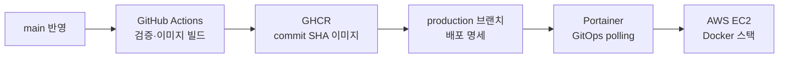
```mermaid
flowchart LR
    A["main 반영"]
    B["GitHub Actions<br/>검증·이미지 빌드"]
    C["GHCR<br/>commit SHA 이미지"]
    D["production 브랜치<br/>배포 명세"]
    E["Portainer<br/>GitOps polling"]
    F["AWS EC2<br/>Docker 스택"]

    A --> B
    B --> C
    C --> D
    D --> E
    E --> F
```

`main`에 변경이 반영되면 GitHub Actions가 Backend와 Nginx Image를 GHCR에 commit SHA로 저장하고, `production` Branch의 배포 명세를 같은 SHA로 갱신합니다. Portainer는 해당 Branch를 5분마다 확인해 AWS EC2 Docker Stack을 자동으로 재배포합니다.

GitHub Actions가 Portainer API를 직접 호출하지 않고 Git 저장소의 배포 명세를 원하는 상태로 사용하는 GitOps 구조입니다.

## 빠른 실행

Docker Desktop이 필요합니다.

```powershell
git clone https://github.com/Techeer-Bootcamp-2026-Summer-Team-C/team-C.git
Set-Location .\team-C
docker compose up -d --build --wait
```

Dashboard: `http://127.0.0.1:8080`

관리자 계정은 최초 실행 시 `runtime/demo/credentials.json`에 자동 생성되며 해당 파일은 Git에 포함되지 않습니다.

```powershell
docker compose ps
docker compose down
```

## 팀원 소개

| 황건하 | 박소연 | 이혜령 | 이주호 |
| :---: | :---: | :---: | :---: |
|  |  |  |  |
| [@altius03](https://github.com/altius03) | [@yoskrap](https://github.com/yoskrap) | [@hyernglee](https://github.com/hyernglee) | [@coder072](https://github.com/coder072) |
| Team Leader<br>Full Stack<br>DevOps | Full Stack<br>DevOps | Frontend<br>Design | Backend |
