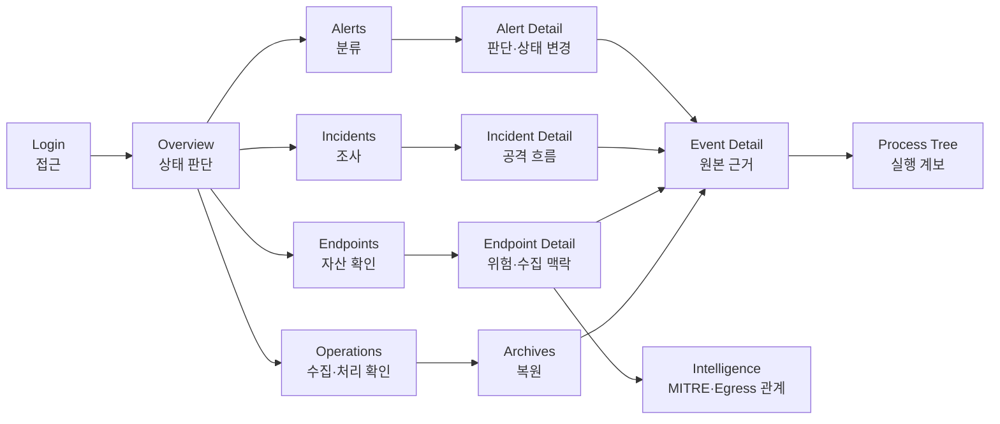
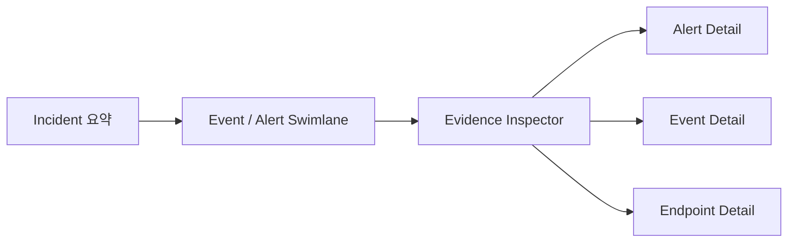
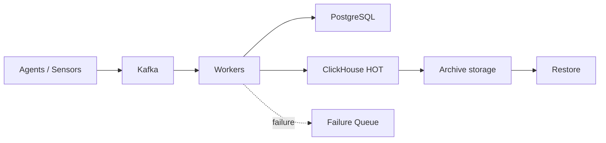
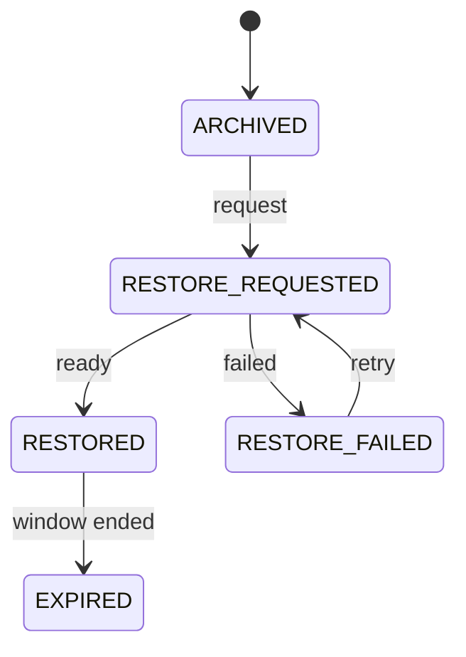

# Frontend UI 개편 결정 워크숍

- 문서 상태: 권장안 전체 확정
- 작성일: 2026-07-15
- 대상: Frontend, Backend, 기획·발표 담당
- 범위: Login, AppShell, Overview, 목록·상세 화면, Intelligence, Operations, Archives
- 결정일: 2026-07-15
- 원칙: 설명을 읽은 직후 같은 절의 `바로 결정` 표에 결론을 기록한다.

## 0. 이 문서로 회의하는 방법

각 결정은 다음 형식으로 기록한다.

| 항목 | 작성 방법 |
| --- | --- |
| 선택 | 선택지 번호 또는 팀이 합의한 대안 |
| 최종 결정 | 실제 구현 문장으로 작성 |
| 담당 | Frontend, Backend, Design 중 담당자 |
| 시점 | 이번 개편 / 후속 단계 |

결정이 구현을 막으면 `이번 개편`으로, 검증 없이도 현재 계약으로 진행할 수 있으면 권장안을 채택한다. 결정하지 못한 항목은 빈칸으로 두지 않고 `후속 검증: 담당자 / 기한`을 적는다.

### 이미 합의된 원칙

- [x] 목적이 명확한 gradient 사용을 허용하되 semantic status와 text contrast를 보호한다.
- [x] 팀 토의 이미지 4장은 pattern 참고로 사용하고 화면을 그대로 복제하지 않는다.
- [x] Sidebar group과 순서를 권장안으로 확정한다.
- [x] Overview는 `상태·핵심 원인·우선 조사 대상`에 집중한다.
- [x] 상세 데이터는 담당 화면으로 분산한다.
- [x] 정보는 `상태 → 원인 → 우선 대상 → 근거 → 다음 행동` 순으로 읽힌다.
- [x] 관계·시간·계층 데이터는 적합한 시각화를 사용한다.
- [x] 현재 API가 제공하지 않는 이력·인과·처리량을 있는 것처럼 표현하지 않는다.

## 1. 제품 목적과 전체 조사 흐름

> 운영자가 현재 위험과 수집 이상을 빠르게 인지하고, 우선 조사 대상을 선택해 근거 Event까지 추적한 뒤, 권한 안에서 필요한 후속 조치를 놓치지 않게 하는 EDR 관제 콘솔



사용자는 목록에서 상세로 이동한 뒤 돌아와도 시간 범위, 필터, 정렬, 페이지와 선택 위치를 잃지 않아야 한다.

## 2. Overview 축소

### 2.1 Overview가 답할 질문

1. 지금 전체 상태는 정상인가, 주의인가, 위험인가?
2. 그 상태를 만든 가장 중요한 이유는 무엇인가?
3. 지금 어떤 Alert, Incident 또는 Endpoint부터 확인해야 하는가?

### 2.2 기본 10개 블록 제안

| 순서 | 블록 | 답하는 질문 |
| --- | --- | --- |
| 1 | EDR State | 현재 전체 상태가 위험한가? |
| 2 | Alerts KPI | 선택 구간의 탐지 규모는 얼마인가? |
| 3 | Open Incidents KPI | 현재 열린 Incident는 몇 개인가? |
| 4 | High-risk Endpoints KPI | 우선 확인할 Endpoint가 있는가? |
| 5 | Event Failures KPI | 수집·처리 실패가 있는가? |
| 6 | Detection Activity | Event·Alert·Incident가 언제 변했는가? |
| 7 | Alert Severity | 고위험 Alert 비중은 얼마인가? |
| 8 | Endpoint Risk Distribution | 자산 위험이 어떻게 분포하는가? |
| 9 | Highest-risk Endpoints | 어떤 Endpoint부터 볼 것인가? |
| 10 | Incident Queue | 어떤 Incident부터 볼 것인가? |

```text
┌─────────────────────────────────────────────────────────────────────┐
│ Overview                  [Time range] [Endpoint] [Last refreshed] │
├─────────────────────────────────────────────────────────────────────┤
│ EDR STATE · Threat · Collection Health · 핵심 원인 · 바로가기      │
├──────────────┬──────────────┬──────────────┬────────────────────────┤
│ Alerts       │ Open Incident│ High-risk EP │ Event Failures         │
├──────────────────────────────────────┬──────────────────────────────┤
│ Detection Activity Small Multiples   │ Alert Severity              │
├───────────────────────┬──────────────┴──────────────────────────────┤
│ Endpoint Risk         │ Highest-risk Endpoints                     │
├───────────────────────┴─────────────────────────────────────────────┤
│ Incident Queue                                                      │
└─────────────────────────────────────────────────────────────────────┘
```

### 2.3 기본 Overview에서 제거할 8개 위젯

1. Endpoint operating systems
2. Sensor health
3. Top rules
4. MITRE detection distribution
5. Process and network signals
6. File, DNS, and L7 signals
7. Failure distribution
8. Storage distribution

사용자 layout에서 단순히 숨기는 것이 아니라 신규 기본 정보 구조에서 제외한다. 기존 저장 layout은 migration 정책이 필요하다.

### 바로 결정: Overview

| ID | 질문 | 선택지 | 권장안 | 최종 결정·담당 |
| --- | --- | --- | --- | --- |
| O1 | 기본 크기를 확정할 것인가? | ① 10개 ② 15개 내외 ③ 완전 자유 | ① | 확정: ① |
| O2 | 위 10개 블록 구성을 확정할 것인가? | ① 그대로 ② 일부 교체 | ① | 확정: ① |
| O3 | 8개 위젯과 기존 저장 layout을 어떻게 처리할 것인가? | ① 기본 제거+자동 migration ② 기본 숨김 ③ 기존 사용자는 유지 | ① + 1회 안내 | 확정: ① + 1회 안내 |
| O4 | Events·Online Endpoints·Storage·Guidance 요약을 어떻게 처리할 것인가? | ① 상세 화면 이동·통합 ② Overview 유지 | ① Detection Activity·Collection Health·Archives·Alert Detail로 이동 | 확정: 권장안 |

## 3. 정보의 소유 화면과 Navigation

### 3.1 제거 정보의 목적지

| 정보 | 소유 화면 | 표현 방식 |
| --- | --- | --- |
| Endpoint OS | Endpoints | OS 분포, 필터, 인벤토리 |
| 개별 Sensor Health | Endpoint Detail | sensor 상태와 drops·parse errors |
| 전체 Sensor Health | Operations | Collection Health 원인 |
| Top Rules | Alerts / Intelligence | Queue 필터 / Rule 분석 탭 |
| MITRE | Intelligence | ATT&CK Matrix와 Alert drill-down |
| Process·Network·File·DNS·L7 | Intelligence / Events | 집계·관계 분석 / 원본 근거 |
| Failure Distribution | Operations | Pipeline 단계와 Failure Queue |
| Storage Distribution | Operations / Archives | 운영 상태 / 복원 작업 |

### 바로 결정: 정보 소유

| ID | 질문 | 선택지 | 권장안 | 최종 결정·담당 |
| --- | --- | --- | --- | --- |
| I1 | Top Rules의 주 위치는 어디인가? | ① Alerts ② Intelligence ③ 양쪽 역할 분리 | ③ Alerts 필터+Intelligence 분석 | 확정: 권장안 |
| I2 | Sensor Health를 어떻게 나눌 것인가? | ① Endpoints ② Operations ③ 전체/개별 분리 | ③ | 확정: ③ |
| I3 | Signal·Failure·Storage의 소유 화면을 위 표대로 확정할 것인가? | ① 확정 ② 일부 변경 | ① | 확정: ① |

### 3.2 AppShell 제안

현재 평면 메뉴를 조사 흐름에 맞는 네 그룹으로 읽히게 한다. URL은 유지한다.

```text
OVERVIEW

TRIAGE
  Alerts
  Incidents

EVIDENCE
  Endpoints
  Events

ANALYSIS
  Intelligence

PLATFORM
  Operations
    Archives
```

- 상세 화면에는 Breadcrumb와 목록 복귀를 함께 제공한다.
- 전역 검색은 현재 가능한 Endpoint ID와 Process Name 검색 범위를 명시한다.
- Login은 그래프를 넣지 않고 제품·환경, 인증 폼, 오류, 세션 안내 순으로 단순화한다.
- 모바일 Navigation은 focus를 가두는 modal drawer로 제공한다.

### 바로 결정: Navigation

| ID | 질문 | 선택지 | 권장안 | 최종 결정·담당 |
| --- | --- | --- | --- | --- |
| N1 | 메뉴를 네 그룹으로 묶을 것인가? | ① 그룹 적용 ② 현재 유지 ③ 다른 순서 | ① | 확정: ① |
| N2 | Archives와 Breadcrumb를 어떻게 제공할 것인가? | ① Operations 하위+Breadcrumb ② 독립 메뉴 ③ 현재 버튼만 | ① | 확정: ① |
| N3 | 전역 검색 1차 범위는 어디까지인가? | ① 현재 범위 명시 ② Alert·Event ID 추가 ③ hostname·Rule까지 | ①, 확장은 후속 | 확정: 권장안 |

## 4. 목록·상세 화면의 공통 조작

### 4.1 목록 공통 골격

```text
┌─────────────────────────────────────────────────────────────────────┐
│ Title · 결과 수 · 최신성                              [주 행동]    │
├─────────────────────────────────────────────────────────────────────┤
│ [기본 필터 3개] [상세 필터 ▾] [적용 chip] [초기화]                 │
├─────────────────────────────────────────────────────────────────────┤
│ 분포·추이 요약 / 선택한 필터 설명                                  │
├─────────────────────────────────────────────────────────────────────┤
│ 우선순위 Table: 식별자 | 위험 | 상태 | 맥락 | 최근 시각           │
├─────────────────────────────────────────────────────────────────────┤
│ 결과 범위 · 페이지 크기 · Pagination                               │
└─────────────────────────────────────────────────────────────────────┘
```

- 자주 쓰는 필터 3개만 기본 노출하고 나머지는 상세 필터에 둔다.
- 적용 필터는 chip으로 표시하고 하나씩 제거할 수 있게 한다.
- URL query를 filter·sort·page의 source of truth로 사용한다.
- 데이터 없음과 필터 결과 없음을 구분한다.

### 바로 결정: 목록 조작

| ID | 질문 | 선택지 | 권장안 | 최종 결정·담당 |
| --- | --- | --- | --- | --- |
| L1 | 기본 필터를 3개 이내로 제한할 것인가? | ① 3개+상세 필터 ② 모두 노출 | ① | 확정: ① |
| L2 | 상세 복귀 시 무엇을 보존할 것인가? | ① 필터 ② 필터·정렬 ③ 필터·정렬·페이지·선택 | ③ | 확정: ③ |
| L3 | 저장된 보기를 이번에 만들 것인가? | ① 포함 ② URL 공유만 ③ 후속 | ②, 저장 기능은 후속 | 확정: 권장안 |

### 4.2 공통 상태·권한·반응형

| 상태 | 표현 원칙 |
| --- | --- |
| Initial loading | 최종 layout과 같은 skeleton |
| Refetching | 기존 데이터 유지, 갱신 중 표시 |
| Stale | 마지막 성공 시각과 재시도 표시 |
| Partial failure | 정상 panel 유지, 실패 panel만 오류 |
| Empty | 데이터 없음과 필터 결과 없음 구분 |
| Invalid filter | field 가까이에 이유와 해결 방법 표시 |
| Archive not ready | 일반 오류와 구분해 Restore 경로 제공 |
| Read only | 역할과 제한을 짧게 설명 |

| 기능 | ADMIN | ANALYST | VIEWER |
| --- | --- | --- | --- |
| 조회·필터·drill-down | 가능 | 가능 | 가능 |
| Alert 상태 변경 | 가능 | 가능 | 읽기 전용 |
| Archive restore | 가능 | 가능 | 읽기 전용 |
| Incident lifecycle | Backend 관리 | Backend 관리 | Backend 관리 |
| Guidance·Tree·Topology | 읽기 전용 | 읽기 전용 | 읽기 전용 |

- Desktop: Queue+Detail, graph+Inspector의 2열 구조
- Tablet: Inspector를 graph 아래로 이동
- Mobile: 단일 열, filter drawer, 목록 card
- 200% 확대와 `prefers-reduced-motion`을 완료 조건으로 검증

### 바로 결정: 공통 품질

| ID | 질문 | 선택지 | 권장안 | 최종 결정·담당 |
| --- | --- | --- | --- | --- |
| F1 | 현재 권한 구분을 유지할 것인가? | ① 유지 ② 역할 조정 | ① | 확정: ① |
| F2 | Mobile 표와 graph를 어떻게 처리할 것인가? | ① 가로 축소 ② card·관계 목록 ③ 화면별 자유 | ②, 원본 표만 제한적 scroll | 확정: 권장안 |
| F3 | 키보드·200% 확대·reduced-motion을 완료 조건으로 둘 것인가? | ① 필수 ② 후속 | ① | 확정: ① |
| F4 | 인쇄 보고서에서 Raw Payload와 사용자 정보를 제외할 것인가? | ① 기본 제외 ② 포함 ③ 사용자 선택 | ① | 확정: ① |

## 5. 화면별 개편과 즉시 결정

### 5.1 Alerts와 Alert Detail

#### 제안

- Alerts: 미처리 상태 → Severity·Risk → Rule → Endpoint → 탐지 시각
- Overview에서 빠진 Top Rules를 ranked bar로 제공하고 선택 시 `ruleCode` 필터 적용
- Alert Detail은 Desktop에서 Active Queue와 Detail을 나란히 배치
- Source Event → Alert → Incident는 evidence chain으로 보여주되 인과관계로 단정하지 않음
- Response Guidance는 읽기 전용
- ADMIN·ANALYST만 상태 변경 가능

```text
┌──────── Active Queue ────────┬──────── Alert Detail ────────────────┐
│ Severity · Risk             │ 핵심 판단 요약 · Status              │
│ Rule · Endpoint · 시각      ├───────────────────────────────────────┤
│ 현재 선택                   │ Event → Alert → Incident              │
│                             ├────────────────┬──────────────────────┤
│                             │ MITRE·Endpoint │ Save / Save+Next     │
│                             ├────────────────┴──────────────────────┤
│                             │ Response Guidance                    │
└─────────────────────────────┴───────────────────────────────────────┘
```

#### 바로 결정

| ID | 질문 | 선택지 | 권장안 | 최종 결정·담당 |
| --- | --- | --- | --- | --- |
| A1 | Alerts 기본 우선순위는 무엇인가? | ① 최신순 ② 상태→Severity→Risk ③ 사용자 선택 | ②, 최신 시각 보조 | 확정: 권장안 |
| A2 | Queue+Detail 구조를 유지할 것인가? | ① Desktop split ② 단일 상세 ③ 항상 drawer | ①, Mobile drawer | 확정: 권장안 |
| A3 | 상태 저장 후 동작은 무엇인가? | ① 현재 유지 ② 자동 다음 ③ 두 버튼 | ③ `저장`·`저장 후 다음` | 확정: 권장안 |

### 5.2 Incidents와 Incident Detail

#### 제안

- 목록: OPEN → Severity → 최근 탐지 → Alert 수 → Endpoint → window
- 상세: 영향 요약 → 공통 시간축의 Event·Alert swimlane → 선택 evidence Inspector → 연결 Alerts
- Incident lifecycle은 Backend 계산 상태를 읽기 전용으로 표시
- 연속된 Event 사이에 확인되지 않은 인과 화살표를 만들지 않음
- 같은 차트의 series는 공유 scale을 사용하거나 Small Multiples로 분리



#### 바로 결정

| ID | 질문 | 선택지 | 권장안 | 최종 결정·담당 |
| --- | --- | --- | --- | --- |
| C1 | Timeline 1차 범위는 어디까지인가? | ① 세로 목록 개선 ② swimlane ③ swimlane+Inspector | ③ | 확정: ③ |
| C2 | Incident 상태를 계속 읽기 전용으로 둘 것인가? | ① 유지 ② 수동 변경 추가 | ① | 확정: ① |

### 5.3 Endpoints와 Endpoint Detail

#### 제안

- 목록: Risk → Stale·Status → Active Alerts·Open Incidents → Last Seen → OS
- OS와 Risk는 pie 대신 stacked bar 또는 ranked bar
- 상세: Risk·Stale → Risk Factor → Alert·Incident → Sensor → Event·Process → Profile·Certificate
- Process Tree API가 Endpoint와 시간 범위를 받으므로 Endpoint Detail에서도 진입점 제공
- Certificate는 기본 접힘, revoked·expired면 자동 펼침

```text
┌──────── Endpoint · Status · Risk · Last Seen ──────────────────────┐
│ 조사 요약: 위험 원인 · 수집 상태 · Alert·Incident                 │
├──────────────────────────────┬──────────────────────────────────────┤
│ Risk factors ranked bar      │ Sensor health strip                 │
├──────────────────────────────┴──────────────────────────────────────┤
│ Event activity / recent Events                                     │
├──────────────────────────────┬──────────────────────────────────────┤
│ Process Tree                 │ Profile · Capability · Certificate  │
└──────────────────────────────┴──────────────────────────────────────┘
```

#### 바로 결정

| ID | 질문 | 선택지 | 권장안 | 최종 결정·담당 |
| --- | --- | --- | --- | --- |
| E1 | Endpoint Detail에 Process Tree를 둘 것인가? | ① Event에만 ② Endpoint에도 시간 선택 제공 | ② | 확정: ② |
| E2 | Endpoint별 Event activity API가 없을 때 무엇을 제공할 것인가? | ① 화면에서 임시 집계 ② 최근 Event+Events 링크 ③ API 선행 | ② | 확정: ② |
| E3 | Certificate 표시 방식은 무엇인가? | ① 항상 펼침 ② 기본 접힘 ③ 이상만 표시 | ②, 이상이면 자동 펼침 | 확정: 권장안 |

### 5.4 Events와 Event Detail

#### 제안

- 목록: 발생 시각 → 유형 → Endpoint → 핵심 행위 → 수집 시각
- 기본 필터: 시간·Endpoint·Event Type
- Process, File, Domain, IP, DNS, L7은 유형별 상세 필터
- Event Type에 따라 process·network·file 핵심 열을 교체
- 상세 field는 Process, File, Network, DNS, HTTP·TLS, Identity로 그룹화
- Process Tree를 Raw Payload보다 먼저 배치
- Raw Payload는 기본 접힘, 복사, 검색 제공
- `ARCHIVE_NOT_READY`는 Archives 이동 action 제공

#### 바로 결정

| ID | 질문 | 선택지 | 권장안 | 최종 결정·담당 |
| --- | --- | --- | --- | --- |
| V1 | 목록 열을 Event Type별로 바꿀 것인가? | ① 고정 열 ② 공통 식별+유형별 열 | ② | 확정: ② |
| V2 | 상세 field를 그룹화할 것인가? | ① 단일 Grid ② 유형별 그룹·접기 | ② | 확정: ② |
| V3 | Raw Payload의 기본 방식은 무엇인가? | ① 펼침 ② 접힘 ③ 별도 화면 | ② + 복사·검색 | 확정: 권장안 |

### 5.5 Intelligence

#### 제안

- MITRE tactic·technique 막대를 ATT&CK Matrix heatmap으로 통합
- cell 선택 시 관련 Alert, Endpoint, 시간 추이를 Inspector에 표시
- Egress card+table을 node-edge graph로 보강하되 table fallback 유지
- edge 굵기는 Event 수 같은 관측량이며 bandwidth로 표현하지 않음
- Rules, Processes, Domains, IPs, Files, DNS, L7을 공통 ranked-list 탭으로 제공
- 노드가 많으면 위험·최근 활동 기준 Top-N과 검색 사용

```text
┌──────── MITRE ATT&CK Matrix ──────────┬──── Technique Inspector ────┐
│ tactic · technique · count           │ Alerts · Endpoints · trend │
├──────── Egress Topology ──────────────┼──── Relation Inspector ─────┤
│ Endpoint ─ protocol/count ─ target    │ Events · Alerts · lastSeen │
├───────────────────────────────────────┴─────────────────────────────┤
│ Rules | Processes | Domains | IPs | Files | DNS | L7               │
└─────────────────────────────────────────────────────────────────────┘
```

#### 바로 결정

| ID | 질문 | 선택지 | 권장안 | 최종 결정·담당 |
| --- | --- | --- | --- | --- |
| T1 | MITRE를 Matrix로 통합할 것인가? | ① Matrix ② 현재 막대 ③ 둘 다 | ① + 표 fallback | 확정: 권장안 |
| T2 | Topology 1차 범위는? | ① 정적 graph ② 선택+Inspector ③ table 유지 | ② + table fallback | 확정: 권장안 |
| T3 | Rules와 Signal Top-N을 탭으로 통합할 것인가? | ① 통합 ② 화면 분리 | ① | 확정: ① |

### 5.6 Operations와 Archives

#### Operations 제안



- 종합 상태가 Collection, Detection, Storage 중 어떤 축 때문에 저하됐는지 설명
- Pipeline node 선택 시 Service·Worker·Failure 근거로 이동
- 현재 health는 snapshot이므로 정적 방향 화살표 사용
- 실제 처리량이나 상태 이력 API가 생긴 뒤 flow animation과 State Timeline 추가
- Failure stage ranked bar → filter → Failure Queue 순으로 배치
- Storage는 lifecycle 상태만 요약하고 실제 작업은 Archives에서 수행

#### Archives 제안



- Endpoint IDs·from·to 입력 → lifecycle 요약 → Bucket 표 → Restore action
- 31일 제한과 오류는 field 바로 아래 표시
- ADMIN·ANALYST만 restore 요청
- 요청 직후 `RESTORE_REQUESTED`로 표시하고 완료처럼 보이지 않게 함
- RESTORED Bucket에서 동일 Endpoint·시간 범위의 Events로 이동

#### 바로 결정

| ID | 질문 | 선택지 | 권장안 | 최종 결정·담당 |
| --- | --- | --- | --- | --- |
| OP1 | Pipeline 1차 표현은 무엇인가? | ① snapshot 정적 graph ② 움직이는 flow ③ 이력 API 후 구현 | ① | 확정: ① |
| OP2 | Service·Worker 이력은 이번에 포함할 것인가? | ① 포함 ② 후속 | ② | 확정: ② |
| OP3 | Storage와 restore 역할을 분리할 것인가? | ① Operations 상태+Archives 작업 ② 한 화면 통합 | ① | 확정: ① |
| OP4 | Archive lifecycle board를 적용할 것인가? | ① 적용 ② 표만 유지 | ① + 표 | 확정: 권장안 |

## 6. 시각화와 움직임

### 6.1 시각화 선택표

| 데이터 | 시각화 | 핵심 상호작용 | 현재 가능 여부 |
| --- | --- | --- | --- |
| Detection Activity | 공통 X축 Small Multiples | crosshair, 시간 선택 | 가능 |
| Alert Severity·Endpoint Risk·Top Rules | 정확한 수치의 ranked bar | 목록 필터 | 가능 |
| MITRE | ATT&CK Matrix Heatmap | Technique 선택 | mapping 결합 필요 |
| Egress | Node-edge Graph | node·edge 선택, Inspector | 가능 |
| Process | Tree Graph | 부모·자식 강조 | 가능 |
| Incident evidence | Swimlane Timeline | zoom, filter, Inspector | 가능 |
| Operations Pipeline | 방향성 Graph | node 선택 | snapshot으로 가능 |
| Service·Worker 이력 | State Timeline | 장애 구간 확대 | 이력 API 필요 |
| Storage | Lifecycle board | Archives 이동 | 가능 |

### 6.2 움직임 원칙

사용한다:

- 선택한 node·edge·evidence 강조
- filter 변경 시 mark의 짧은 위치·값 전환
- Inspector가 열려도 선택 관계 유지
- 실제 흐름 데이터가 있을 때만 낮은 속도의 방향 pulse

사용하지 않는다:

- polling마다 차트를 다시 등장시키는 animation
- 처리량 데이터 없는 edge 속도 표현
- 확인되지 않은 공격 인과 화살표
- bucket 상태 수를 이동량처럼 보이게 하는 Sankey
- 지속 점멸과 무한 위험 효과

### 6.3 데이터 표현 경계

| 데이터 경계 | 금지할 오해 |
| --- | --- |
| Egress는 Event·Alert 수와 protocol·lastSeen을 제공 | 실제 bandwidth·packet 흐름으로 표현 금지 |
| Incident Timeline은 관측 시각 순서 | 확인된 공격 인과로 표현 금지 |
| Operations Health는 현재 snapshot | 과거 상태 이력이 있는 것처럼 표현 금지 |
| Storage는 상태별 bucket 수 | 단계 사이 실제 이동량으로 표현 금지 |
| Response Guidance는 읽기 전용 | 자동 Playbook·원격 제어처럼 표현 금지 |

### 바로 결정: 시각화 기술

| ID | 질문 | 선택지 | 권장안 | 최종 결정·담당 |
| --- | --- | --- | --- | --- |
| X1 | 정량 chart 기술은? | ① 기존 SVG ② ECharts ③ 다른 기술 | ② PoC | 확정: ② PoC 후 적용 |
| X2 | 관계 graph 기술은? | ① React Flow+Dagre ② ECharts Graph ③ 직접 SVG | ① PoC | 확정: ① PoC 후 적용 |
| X3 | UI 모션 기술은? | ① CSS ② Motion for React ③ 혼합 | CSS 우선, 복잡 전환만 Motion | 확정: 권장안 |
| X4 | 모든 chart·graph에 text·table fallback을 둘 것인가? | ① 전부 ② 일부 ③ 없음 | ① | 확정: ① |

## 7. Frontend와 Backend 범위

| 화면 | 현재 계약으로 가능한 1차 범위 | Backend 보강 후보 |
| --- | --- | --- |
| AppShell | 그룹, Breadcrumb, 필터 보존 | 다중 유형 전역 검색 |
| Overview | 위젯 축소, 재배치, drill-down | 이전 기간 비교 |
| Alerts | Queue, status mutation, Rule 필터 | 필터 일치 Rule 집계 |
| Incidents | Timeline, 연결 Alerts | 영향 자산·비교 집계 |
| Endpoints | OS·Risk, Sensor 상세 | Endpoint별 Event activity |
| Events | 유형별 layout, Process Tree | histogram 집계·facet |
| Intelligence | 현재 MITRE·Topology 시각화 | Technique 추이·target enrichment |
| Operations | snapshot Pipeline, Failure·Storage | 상태 이력·단계 throughput |
| Archives | 조회·restore·polling | retry 정책 확장 시 계약 |

### 구현 단계

| 단계 | 범위 |
| --- | --- |
| P0 | Overview 축소, 정보 이동, Navigation, 공통 목록·상세 순서 |
| P1 | 공통 chart panel, Small Multiples, ranked bar, fallback |
| P2 | MITRE Matrix, Topology, Process Tree 진입, Incident Timeline, Pipeline |
| P3 | 비교값, 집계, 상태 이력, throughput, enrichment API |
| P4 | 키보드, 200% 확대, Mobile, polling 안정성, reduced-motion |

### 바로 결정: 범위와 배포

| ID | 질문 | 선택지 | 권장안 | 최종 결정·담당 |
| --- | --- | --- | --- | --- |
| B1 | 이번 Backend 범위에 어떤 API를 포함할 것인가? | ① 없음 ② Events histogram ③ Rule 집계 ④ 상태 이력·throughput ⑤ 선택 조합 | 현재 계약으로 P0, P1에 꼭 필요한 API만 별도 확정 | 확정: ⑤ UI 필수 Backend 조합 |
| R1 | 첫 배포 범위는? | ① P0 ② P0+P1 ③ 전체 일괄 | ② | 확정: ② |
| R2 | P2 구현 순서는? | ① Incident→Process→Topology→MITRE→Pipeline ② 다른 순서 | 사용자 조사 빈도와 발표 우선순위로 결정 | 확정: ① |
| R3 | chart·graph를 feature flag로 단계 배포할 것인가? | ① 사용 ② 일괄 교체 | ① | 확정: ① |

`B1`의 UI 필수 Backend 조합은 다음으로 제한한다.

- 기존 `DashboardSummaryDto`의 Event time series, Top Rules와 MITRE 집계를 재사용하고 중복 aggregate endpoint를 만들지 않는다.
- paged 목록의 승인된 sort/filter contract와 Endpoint hostname·agent ID·exact ID search를 추가한다.
- Incident graph가 client 추정 없이 관측 근거를 표시할 수 있는 investigation read model을 추가한다.
- Overview layout version 2의 기존 저장값 migration과 revision 충돌 계약을 유지한다.
- Service·Worker 장기 이력, `bytesOut`, 원격 response action은 이번 범위에 포함하지 않는다.

## 8. 성공 판단 기준

| 과업 | 초기 목표 |
| --- | --- |
| Overview에서 상태·원인·우선 대상 식별 | 15초 이내, 성공률 90% 이상 |
| 고위험 Alert 상세 진입 | 성공률 95% 이상 |
| Alert에서 Event 또는 Incident 도달 | 주요 클릭 3회 이하 |
| 최고 위험 Endpoint와 Risk Factor 확인 | 성공률 90% 이상 |
| Incident에서 연결 Alert 도달 | 성공률 95% 이상 |
| Event에서 선택 PID의 Process Tree 확인 | 30초 이내, 성공률 90% 이상 |
| Operations에서 장애 단계와 Failure Queue 도달 | 30초 이내, 성공률 90% 이상 |
| Archive restore 상태 확인 | 권한 보유자 성공률 95% 이상 |
| 상세 복귀 시 필터·정렬·페이지 유지 | 100% |
| keyboard·fallback·reduced-motion | 핵심 흐름 100% |
| polling으로 focus·scroll 초기화 | 0건 |

## 9. 회의 종료 기록

### 9.1 결정 현황

| 항목 | 기록 |
| --- | --- |
| 확정한 결정 ID | O1~O4, I1~I3, N1~N3, L1~L3, F1~F4, A1~A3, C1~C2, E1~E3, V1~V3, T1~T3, OP1~OP4, X1~X4, B1, R1~R3 |
| 후속 검증 ID | 없음. PoC 성능·접근성 검증은 구현 완료 조건으로 관리 |
| 이번 Frontend 범위 | Login, AppShell, Overview, Alerts, Incidents, Endpoints, Events, Intelligence, Operations, Archives, 공통 UI와 반응형 |
| 이번 Backend 범위 | 목록 query/search, Incident investigation read model, layout migration, OpenAPI·generated schema 동기화 |
| 제외·후속 범위 | Service·Worker 장기 이력, 저장된 view, 전역 검색 확장, executable response, `bytesOut`, agent telemetry 변경 |
| 1차 리뷰일 | 각 Work Package 완료 시 |

### 9.2 담당자

| 역할 | 담당 | 완료 조건 |
| --- | --- | --- |
| Frontend 정보 구조·공통 UI |  |  |
| Chart PoC |  |  |
| Graph PoC |  |  |
| Backend 계약 |  |  |
| 사용성·접근성 검증 |  |  |
| 발표·데모 시나리오 |  |  |

### 9.3 권장 60분 진행

| 시간 | 내용 | 결정 ID |
| ---: | --- | --- |
| 5분 | 원칙 재확인 | 0장 |
| 10분 | Overview | O1~O4 |
| 10분 | 정보 이동·Navigation·공통 조작 | I1~I3, N1~N3, L1~L3 |
| 20분 | 화면별 작업 방식 | A, C, E, V, T, OP |
| 10분 | 시각화·Backend·배포 | X, B, R |
| 5분 | 결정·담당·기한 확인 | 9장 |

## 10. 현재 기능 경계

이미 구현됨:

- Event 기반 Process Tree
- 읽기 전용 Endpoint Egress Topology 데이터
- Incident Attack Timeline
- 사용자별 Overview layout 저장
- Alert 상태 변경
- Archive restore 요청

현재 제공하지 않음:

- 실제 network bandwidth
- 확인된 공격 인과 그래프
- Service·Worker 상태 이력
- 자동 실행 Response Playbook
- Agent 원격 제어

## 11. 코드·문서 근거

- [Frontend 명세](./FRONTEND_SPEC.md)
- [Risk 정책](../contracts/RISK_POLICY.md)
- [API 계약](../contracts/API_SPEC.md)
- [전체 Route 정의](../../frontend/src/App.tsx)
- [AppShell](../../frontend/src/components/AppShell.tsx)
- [Overview layout](../../frontend/src/features/dashboardLayout.ts)
- [Overview rendering](../../frontend/src/features/overviewWidgetRegistry.tsx)
- [Alerts](../../frontend/src/pages/AlertsPage.tsx)
- [Alert Detail](../../frontend/src/pages/AlertDetailPage.tsx)
- [Incidents](../../frontend/src/pages/IncidentsPage.tsx)
- [Incident Detail](../../frontend/src/pages/IncidentDetailPage.tsx)
- [Endpoints](../../frontend/src/pages/EndpointsPage.tsx)
- [Endpoint Detail](../../frontend/src/pages/EndpointDetailPage.tsx)
- [Events](../../frontend/src/pages/EventsPage.tsx)
- [Event Detail](../../frontend/src/pages/EventDetailPage.tsx)
- [Intelligence](../../frontend/src/pages/IntelligencePage.tsx)
- [Operations](../../frontend/src/pages/OperationsPage.tsx)
- [Archives](../../frontend/src/pages/ArchivesPage.tsx)

## 12. 벤치마크

- [Shadcnblocks Admin Dashboard](https://shadcnblocks-admin.vercel.app/ecommerce/dashboard-1)
- [v0 Shadcn Dashboard](https://v0.app/templates/shadcn-dashboard-Pf7lw1nypu5)
- [Shopeers Analytics Dashboard](https://dribbble.com/shots/26628350-Shopeers-AI-Powered-B2B-eCommerce-Analytics-Dashboard)
- [Sales Analytics CRM Dashboard](https://dribbble.com/shots/27107098-Sales-Analytics-CRM-Dashboard-Design)
- [Finbro Dashboard](https://v0.app/templates/finbro-dashboard-shuOX59VNOv)
- [SalesOps Dashboard](https://v0.app/templates/salesops-dashboard-9q2Mfgu6cDi)
- [Grafana dashboard best practices](https://grafana.com/docs/grafana/latest/visualizations/dashboards/build-dashboards/best-practices/)
- [Grafana Node Graph](https://grafana.com/docs/grafana-cloud/visualizations/panels-visualizations/visualizations/node-graph/)
- [Grafana State Timeline](https://grafana.com/docs/grafana/latest/visualizations/panels-visualizations/visualizations/state-timeline/)
- [Elastic Security Visual Event Analyzer](https://www.elastic.co/docs/solutions/security/investigate/visual-event-analyzer/)
- [Microsoft Defender XDR Incident Investigation](https://learn.microsoft.com/en-sg/defender-xdr/investigate-incidents)
- [Datadog Service Map](https://docs.datadoghq.com/tracing/services/services_map/)
- [Wazuh MITRE ATT&CK](https://documentation.wazuh.com/current/user-manual/ruleset/mitre.html)
- [W3C Animation from Interactions](https://www.w3.org/WAI/WCAG22/Understanding/animation-from-interactions)

### 12.1 팀 토의 이미지

| 파일 | 워크숍에서 확인할 질문 |
| --- | --- |
| `Image20260715205307.png` | Incident graph, Timeline, Process Tree, Selected context가 한 조사 흐름으로 연결되는가? |
| `Image20260715205314.png` | Egress graph와 evidence table이 서로 같은 선택 상태를 설명하는가? |
| `Image20260715205319.png` | Overview가 KPI, 추이, 실시간 이벤트, Incident 우선순위를 과도한 중복 없이 보여주는가? |
| `Image20260715205913.png` | panel gutter와 time control을 Grafana처럼 일관되게 만들면서 EDR task를 유지하는가? |

네 이미지는 layout과 interaction 논의를 위한 참고다. 특히 `Image20260715205319.png`는 그대로 복제하지 않는다. `Image20260715211828.png`는 확인되지 않아 결정 근거에 포함하지 않는다.
